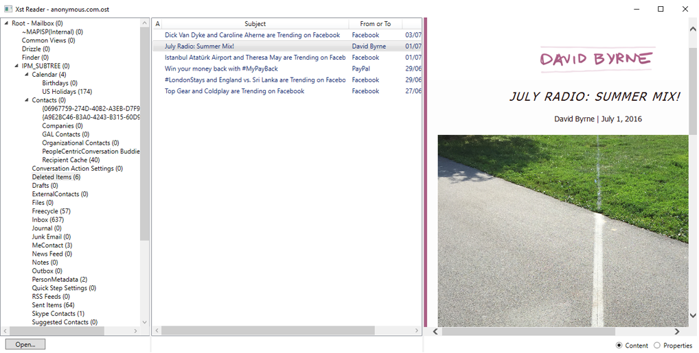

# Xst Reader

Xst Reader is an open source viewer for Microsoft Outlook’s .OST and .PST files, written entirely in C# originally by [Dijji](https://github.com/Dijji). This updated fork has been upgraded from .NET 4 (deprecated) to .NET 4.8 (still supported), and this tool still has no dependency on any Microsoft Office components.

Thanks to the original developer, tt presents as a simple, classic, three pane mail viewer:

Xst Reader goes beyond Outlook in that it will allow you to open .OST files, which are the caches created by Outlook to hold a local copy of a mailbox. Wanting to read an .OST file as the original motivation for this project: now it also as the ability to export the header and body of an email in its native format (plain text, HTML, or rich text), and inspect and export all the properties of an email.

It requires only .Net Framework 4.8, which is installed by default on Windows 10 (May 2019 update and later), but will need to be installed on Windows 10 (October 2018 update and earlier) and earlier systems before Xst Reader can be run, as seen [here](https://learn.microsoft.com/en-us/dotnet/framework/migration-guide/versions-and-dependencies#net-framework-48).

Xst Reader is based on Microsoft’s documentation of the Outlook file formats in [MS-PST], first published in 2010 as part of the anti-trust settlement with the DOJ and the EU, found [here](https://msdn.microsoft.com/en-us/library/ff385210(v=office.12).aspx).

## XstExport

A command line tool for exporting emails, attachments or properties from an Outlook file.

By default, all folders in the Outlook file are exported into a directory structure that mirrors the Outlook folder structure. Options are available to specify the starting Outlook folder and to collapse all output into a single directory.

The differences from the export capabilities of the UI are: the ability to export from a subtree of Outlook folders; and the ability to export attachments only, without the body of the email.

In addition to XstExport, XstPortableExport is also provided, which is a portable version based on .NET Core 2.1 that can be run on Windows, Mac, Linux etc.   
  
NOTE: This updated fork recognizes this is a deprecated version of .NET Core, so that's on the bucket list to fix.

Both versions support the following options:

   XstExport.exe {-e|-p|-a|-h} [-f=`<Outlook folder>`] [-o] [-s] [-t=`<target directory>`] `<Outlook file name>`

Where:

   -e, --email  
      Export in native body format (.html, .rtf, .txt)
      with attachments in associated folder   
   -- OR --   
   -p, --properties  
      Export properties only (in CSV file)   
   -- OR --   
   -a, --attachments  
      Export attachments only
      (Latest date wins in case of name conflict)  
   -- OR --  
   -h, --help  
      Display this help

   -f=`<Outlook folder>`, -folder=`<Outlook folder>`  
      Folder within the Outlook file from which to export.
      This may be a partial path, for example "Week1\Sent"

   -o, --only  
      If set, do not export from subfolders of the nominated folder.

   -s, --subfolders  
      If set, Outlook subfolder structure is preserved.
      Otherwise, all output goes to a single directory

   -t=`<target directory name>`, --target=`<target directory name>`  
      The directory to which output is written. This may be an
      absolute path or one relative to the location of the Outlook file.
      By default, output is written to a directory `<Outlook file name>.Export.<Command>`
      created in the same directory as the Outlook file

   `<Outlook file name>`  
      The full name of the .PST or .OST file from which to export

To run the portable version, open a command line and run:

dotnet XstPortableExport.dll `<options as above>`

## Notes for developers

From the original developer: 

* The provided Visual Studio solution includes a XstReader.Base project, which contains all the basic common functionality for reading Outlook files used by XstReader and XstExport. The project builds a DLL, which you can use to add the same capability to your own projects. XstReader and XstExport do not themselves use the DLL, instead, they simply include the code from the XstReader.Base directory, in order to create executables with minimum dependencies.
* The XstPortableExport project builds a portable version of XstExport based on .Net Core 2.1. However, in order to remain portable, two areas of functionality have to be #ifdef'd out in order not to create a framework dependency and so tie the program to Windows. These are support for RTF body formats, and support for MIME decryption.

## Release History

For the original repo's release history, go [here](https://github.com/Dijji/XstReader#release-history). For the current release history, check the Releases.

## Original License

This project was originally distributed under the MS-PL license. See [license](license.md) for more information.

## Current License

This updated fork will be distributed under the MIT license.
